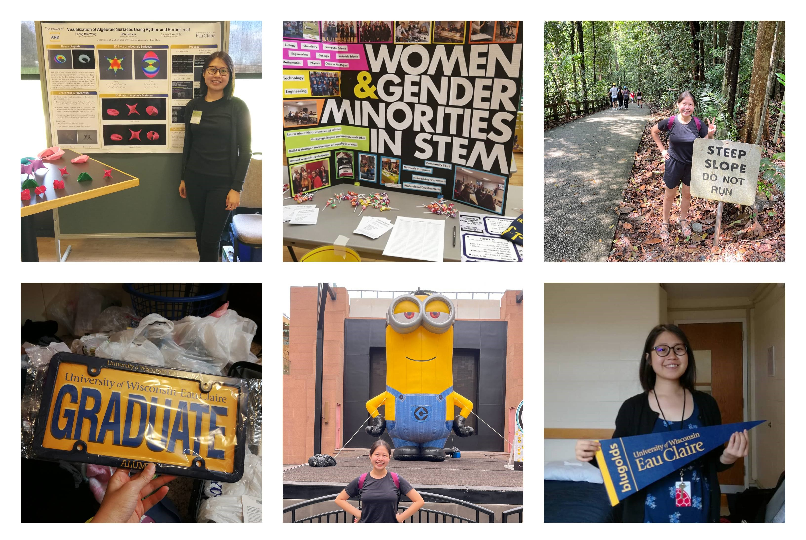

<!-- Global site tag (gtag.js) - Google Analytics -->

`About`

Born and raised in Malaysia, I speak Chinese, Cantonese, English, Malay, and [Python](https://www.python.org/).

`Work`

I previously worked as a [research assistant](archive/research) at UW-Eau Claire.

Now, I am working as an R&D Software Engineer in Singapore.

`Other`

I enjoy blogging on [Medium](https://medium.com/@foongminwong) and doing stuff.

